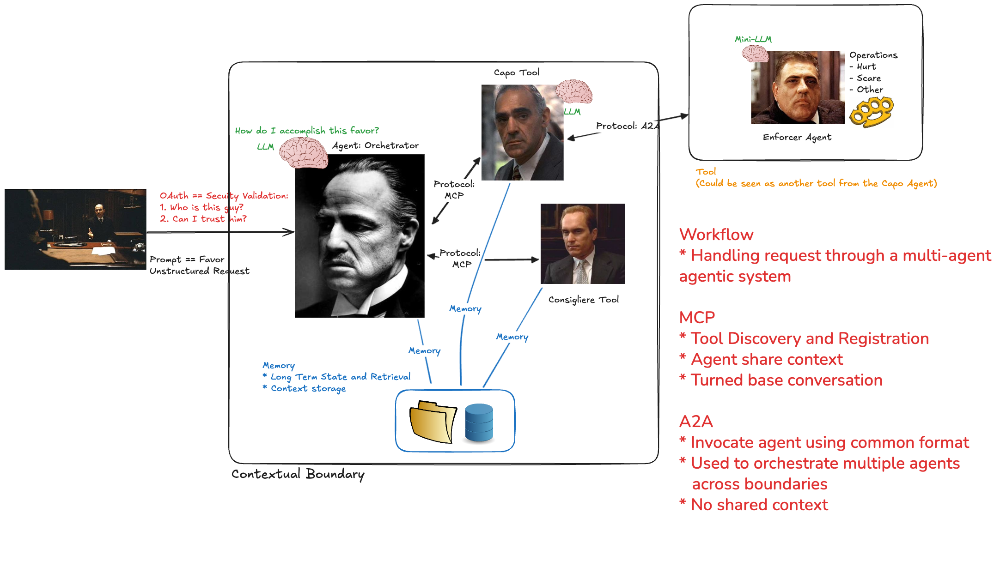

# Title: The Godfather of AI: A Cinematic Analogy for Modern AI Orchestration 
_or how I understand Agentic Applications as of 10/2025_

## Introduction
In the fast-evolving world of AI, understanding the architecture behind intelligent systems can be daunting. But what if we could explain it using one of the most iconic films of all time? Enter The Godfather — a cinematic masterpiece that, surprisingly, offers a perfect metaphor for how orchestrated AI systems work today. 

## Tool Based and MCP Focus Design

## Multi-Agent and A2A Focus Design

## What Comes in the next 6 months?
_Stay Tuned_