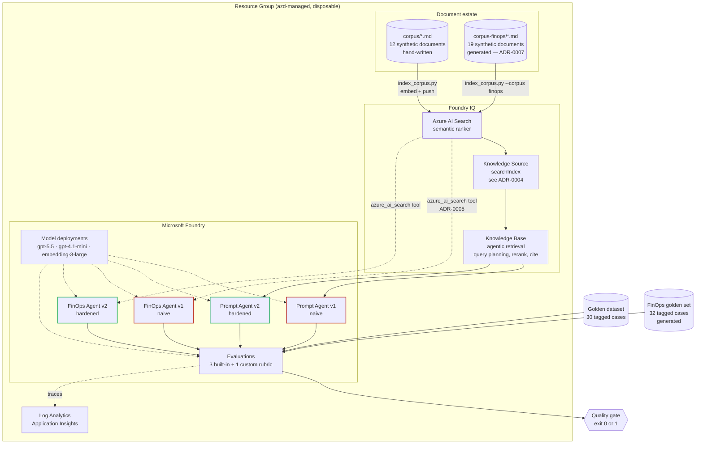
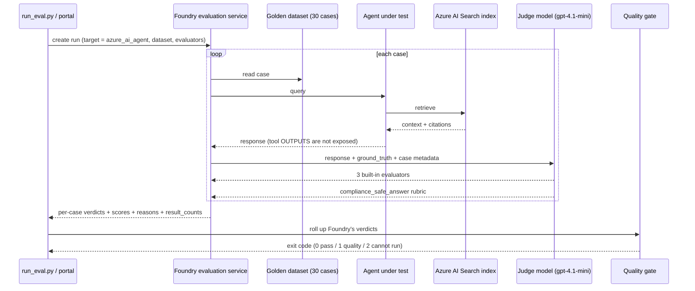

# Architecture

## Overview

**Two demo tracks, one resource group.** They share the Search service, the
model deployments, the Foundry project and the evaluation machinery. They share
nothing else: separate corpus directories, separate indexes, separate agent
pairs, separate golden sets, separate rubrics.

| | Advisor track | FinOps track |
|---|---|---|
| Corpus | `corpus/` — 12, hand-written | `corpus-finops/` — 19, generated |
| Index | `meridian-docs` | `meridian-aiops-costs` |
| Agents | `meridian-advisor-v1` / `-v2` | `meridian-finops-v1` / `-v2` |
| Dataset | 30 cases | 26 cases |
| Rubric | `meridian-compliance-safe-answer` | `meridian-finops-defensible-answer` |
| Grounding | `azure_ai_search` tool, `meridian-docs`, top_k 5 | `azure_ai_search` tool, `meridian-aiops-costs`, top_k 8 |
| Recency rule | newest document wins | **card in effect on the date of consumption** |

That last row is the important one and it is not a detail. In the advisor
corpus the current fee schedule always supersedes; in a cost corpus the
superseded rate card remains the correct authority for the months it covers.
The two tracks therefore need *opposite* recency rules, which is why the rubric
is duplicated rather than shared —
`tests/test_finops_rubric.py::test_it_is_not_a_copy_of_the_advisor_rubric`
fails if anyone tries to consolidate them.

**Both** agent pairs ground through the `azure_ai_search` tool against a project
connection (ADR-0005) — verified 2026-09-23 by reading the published agent
definitions. Earlier revisions of this document claimed the advisor pair
grounded through a Knowledge Base; that was wrong, and it sent the #6
investigation down a blind alley for a day. The advisor Knowledge Base does
exist, but only to serve the recency canary in `setup_knowledge.py`; no agent
retrieves through it.

## The retrieval path

1. A question arrives at the prompt agent.
2. The agent calls its knowledge base tool.
3. Foundry IQ decomposes the question into subqueries and plans retrieval.
4. Azure AI Search executes them against the vectorized corpus, applies the
   semantic reranker, and drops results below the reranker threshold.
5. Results are merged, reranked, and returned with source references.
6. The agent composes an answer. Under v2, every claim carries a citation.

Recency preference — prefer `status: current` and later `effective_date` — was
designed to live in both the knowledge base and v2's prompt, as defence in depth.
The `2026-04-01` API has no `retrievalInstructions` property, so **it now lives
only in v2's prompt** (ADR-0004). One layer, not two. The canary assertion in
`setup_knowledge.py` is what stops that single layer failing silently.

Because `index_corpus.py` pushes documents directly, `status` and
`effective_date` are real index fields rather than text buried in a chunk — which
is what makes the stale-document trap visible in the portal.

## The evaluation path

Evaluation executes **inside Foundry**. Nothing scores locally — `run_eval.py`
creates a run and reads the result back. The same run appears in the portal.
See ADR-0006.

### Foundry owns every verdict

The harness does not score anything. Thresholds live in `evals.config.yaml`
solely to be pushed **into** Foundry's testing criteria when the evaluators are
seeded; they are never compared against a score locally. `run_eval.py` reads the
pass/fail Foundry returns per criterion, takes the run-level verdict from
Foundry's own `result_counts`, and maps it to an exit code. Mapping a published
verdict to 0/1/2 is CI plumbing, not scoring.

This matters because a local pass line is a second, private scoring path. When
it disagrees with the portal — and eventually it will — there is no way to say
afterwards which number the customer was actually shown. So there is no
fallback: if Foundry returns no verdict for a criterion, the run exits **2**
("cannot run") rather than guessing. A result nobody judged is not a pass.

The harness also refuses to emit a scorecard when its own per-case reading
disagrees with Foundry's tally, rather than picking a winner. See § T11 of
`tamper-log.md` for the four guards and the tampers that prove them.

Two consequences of Foundry not exposing tool outputs to evaluators:
groundedness is scored against the golden set's `ground_truth` rather than the
context this run actually retrieved, and `retrieval` is not scored at all — it
would grade the golden set we wrote and could never fail. ADR-0006 covers both.

The agent and the judge use **different** models. A model grading its own output
is a weaker signal, and it is the first thing a sceptical architect will probe.

## Trust boundaries and identity

| Flow | Principal | Mechanism |
|------|-----------|-----------|
| Search vectorizer → embedding model | Search system-assigned MI | `Cognitive Services User` |
| Agent `azure_ai_search` tool → index | Foundry **account** system-assigned MI | `Search Index Data Contributor` + `Search Service Contributor` |
| Knowledge base retrieval → index | Project system-assigned MI | `Search Index Data Reader` |
| Foundry project → App Insights | Project system-assigned MI | `Monitoring Metrics Publisher` |
| Presenter → everything | Entra user token | Resource-scoped data-plane roles |

There are no keys anywhere in this system. `disableLocalAuth` is true on the
Search service, the Foundry account and Application Insights, so the keyless
claim is enforced by configuration rather than by convention. Nine role
assignments, each scoped to one resource.

Two of them are broader than the workload needs: the `azure_ai_search` tool only
reads, but Microsoft requires `Search Index Data Contributor` on the account
identity and `Search Index Data Reader` is rejected. ADR-0005 records the
evidence; `docs/threat-model.md` carries the residual risk rather than hiding
it.

## What is deliberately absent

- **Private endpoints and VNet integration.** A real FSI deployment would have
  them. They add deployment time and cost without changing anything this demo is
  about. `docs/day-2.md` covers the production posture.
- **Multi-agent orchestration.** Prompt agents are legible in the portal. A
  workflow of agents would move attention away from the evaluation.
- **A custom UI.** The portal and the terminal are the interface.

## Cost shape

| Resource | Driver |
|----------|--------|
| Azure AI Search (Basic) | Fixed hourly — the floor of the environment cost |
| Model deployments | Pay per token; idle deployments cost nothing |
| Log Analytics | Negligible at demo volume, 30-day retention |

Per-evaluation cost is 30 cases × 6 evaluators against a small judge model, plus
30 agent completions. Measured figures go in `README.md` (task T10.2).

The environment is designed to be created before an engagement and destroyed
after. `azd down --purge` plus `scripts/verify_teardown.py` makes that safe to do
routinely.
